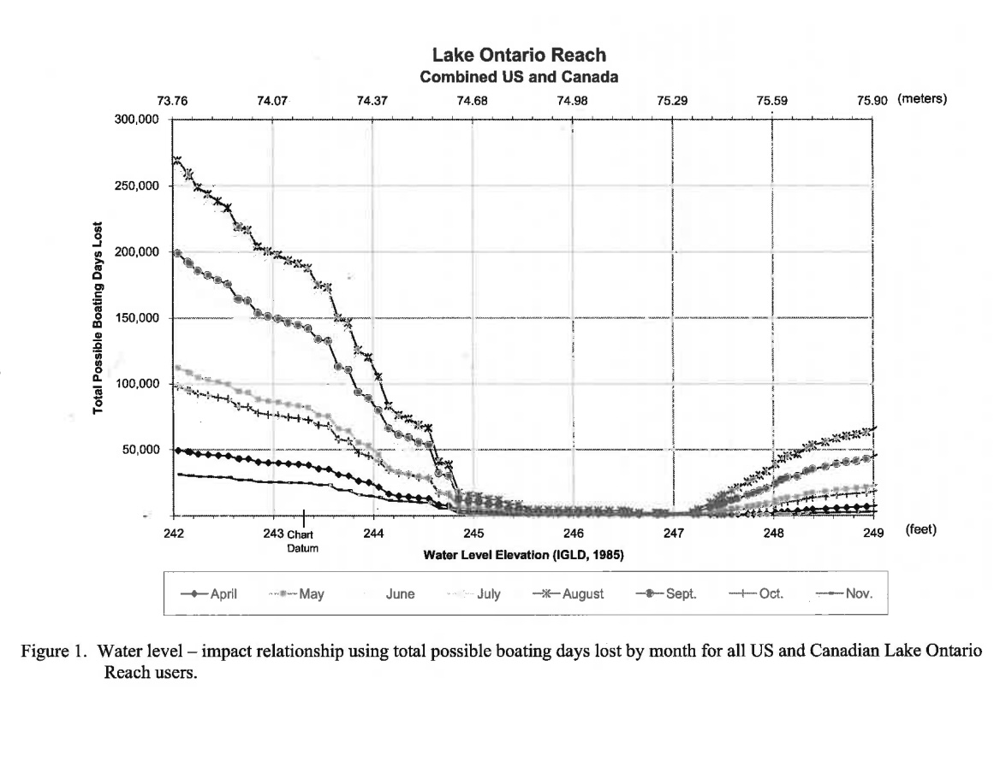

## water 

## money

# (fishing, recreation, power generation, drinking,
# shipping, animal and fish habitat, construction, irrigation, etc.).
# if too much water is drained, then large ships
# cannot travel through the waterways to bring supplies and support the local economy. The main
# problem is regulating the water levels such that all stakeholders can benefit.\

- Determination of the optimal water levels of the five Great Lakes at any time of the year,
taking into account the various stakeholders’ desires (the costs and benefits could be
different for each stakeholder).
- Establishment of algorithms to maintain optimal water levels in the five lakes from
inflow and outflow data for the lakes.
- Understanding of the sensitivity of your control algorithms for the outflow of the two
control dams. Given the data for 2017, would your new controls result in satisfactory or
better than the actual recorded water levels for the various stakeholders for that year?
- How sensitive is your algorithm to changes in environmental conditions (e.g.,
precipitation, winter snowpack, ice jams)?
- Focus your extensive analysis of ONLY the stakeholders and factors influencing Lake
Ontario as there is more recent concern for the management of the water level for this
lake.